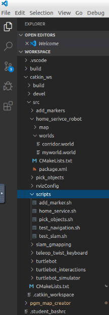

# RoboND-Home-Service-Robot
Project 7 of Udacity Robotics Software Engineer Nanodegree Program

## Overview 
The objective of this project is to set up a robot to map a simulated environment using the ROS Gmapping package, and then navigate the map with the adaptive Monte Carlo localization package. 

## This project implement the 3 steps of autonomous navigation: Perception, Mapping and Localization, Response/Path Planning.
* Created and configured ROS packages to create an autonomous robot that can navigate a simulated environment.
* Model a virtual environment using the Gazebo simulator.
* Mapped the virtual environment by performing Simultaneous Localization and Mapping (SLAM) using the gmapping ROS package.
* Used AMCL to enable the robot to localize itself within the generated map.
* Created markers in Rviz to visualize waypoints used as destinations to which the robot must navigate.

## Project Steps:
* Design a simple environment with the Building Editor in Gazebo.
* Teleoperate your robot and manually test SLAM.
* Use the ROS navigation stack and manually command your robot using the 2D Nav Goal arrow in rviz to move to 2 different waypoints for desired positions and orientations. Write a pick_objects node that commands your robot to move to the desired pickup and drop off zones.
* Write an add_markers node that subscribes to your robot odometry, keeps track of your robot pose, and publishes markers to rviz.

## The following ROS packages are used:
* gmapping: With the gmapping_demo.launch file, you can easily perform SLAM and build a map of the environment with a robot equipped with laser range finder sensors or RGB-D cameras.
* turtlebot_teleop: With the keyboard_teleop.launch file, you can manually control a robot using keyboard commands.
* turtlebot_rviz_launchers: With the view_navigation.launch file, you can load a preconfigured rviz workspace. This will automatically load the robot model, trajectories, and map for you.
* turtlebot_gazebo: With the turtlebot_world.launch you can deploy a turtlebot in a Gazebo environment by linking the world file to it.

## Other ROS Packages and Scripts
* test_slam
This script will launch turtlebot in the gazebo environment along with gmapping node, rviz, and teleop keyboard. 
Click on the teleopkeyboard terminal to teleoperate the robot and map the world, move around slowly to get an accurate map. Once this has been completed save the map to the map server, using map_server node below. ( this map has been already created and is available in the src/home_service_robot/map dir)
cd src/scripts
./test_slam.sh
rosrun map_server map_saver -f myMapCorridor

* test_navigation
This script will launch turtlebot in the gazebo world along with the following nodes: map_server, amcl and move_base (a ROS interface for configuring, running, and interacting with the navigation stack on a robot).
As a result, the robot can localize and navigate itself on the map generated from the test_slam script. Use 2D nav goal from rviz and send goal for the robot.
./test_navigation.sh

* pick_objects
This script, in addition to the test_navigation, will launch the pick_objects node which will send multiple 2D NAV goal locations to the navigation stack to simulate pick up and drop-off motion.
./pick_objects.sh

* add_markers
This script will publish markers on rviz to simulate the virtual object being picked up from a location and dropped off after 5 sec to the drop-off zone.
./add_markers.sh

* home_service
This final script will bring all together and simulate the robot picking up and dropping-off the virtual object while localizing and navigating through the world.
./home_service.sh

## Installation
This simulation have been created and tested in:

* Ubuntu 16.04 (supports Ubuntu 16.04)
* ROS Kinetic (supports ROS kinetic, with melodic has some issues)
* Gazebo 7.0 (supports Gazebo 7.0 or superior)

## Structure  
 
 

## Install Packages
* mkdir -p ~/catkin_ws/src
* cd ~/catkin_ws/src
* catkin_init_workspace
* cd ..
* catkin_make
* sudo apt-get update
* cd ~/catkin_ws/src
* git clone https://github.com/ros-perception/slam_gmapping
* git clone https://github.com/turtlebot/turtlebot
* git clone https://github.com/turtlebot/turtlebot_interactions
* git clone https://github.com/turtlebot/turtlebot_simulator
* cd ~/catkin_ws/
* source devel/setup.bash
* rosdep -i install gmapping
* #All required rosdeps installed successfully
* rosdep -i install turtlebot_teleop
* #All required rosdeps installed successfully
* rosdep -i install turtlebot_rviz_launchersAll required rosdeps installed successfully
* rosdep -i install turtlebot_gazebo
* All required rosdeps installed successfully
* catkin_make
* source devel/setup.bash

## Create catkin workspace:
mkdir -p ~/catkin_ws/src
cd ~/catkin_ws/src
catkin_init_workspace
cd ~/catkin_ws catkin_make

## Run the project
* Clone the following repository to catkin_ws/src:
https://github.com/tdwilhelm/RoboND-Home-Service-Robot.git

* cd ~/catkin_ws catkin_make

* Run ./home_service.sh in Scripts directory to deploy the home service robot.
```  
## Videos  
 
